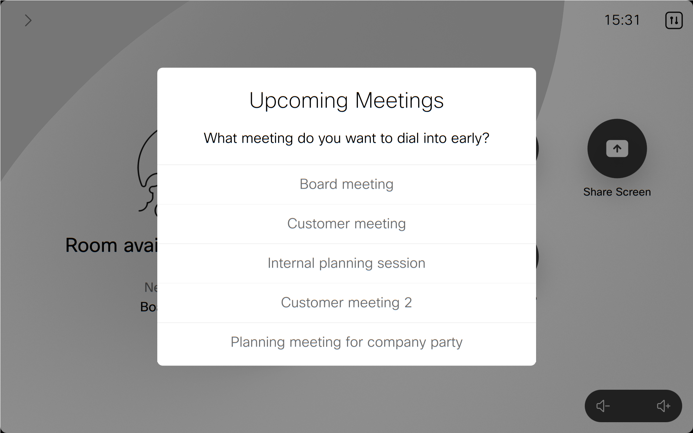

# Early One Button To Push (OBTP)

This macro and UI Extension was created to provide an easy way to early dial into future meetings with a single button. The main use case is to have time to test setups and make sure everything is in order more than 5 minutes prior to meeting start. It was initially built for a customer wanting to be able to dial into  various meetings the executives attended, but it turned out to be more demand for this feature, so here it is.

**Author: Svein Terje Steffensen and Marcel Neidinger**

---
Snapshot of Room Navigator after the "Early OBTP" button has been pressed and there are no upcomping meetings:

---

## Requirements
1. Device must have some form of calendar integration to have bookings pushed to the device.
2. Not supported by devices in Personal mode
3. The booking must contain an alphanumeric URI - WebRTC meetings not supported

## Usage
1. Add the macro and UI extension. When pressing the "Early OBTP"-panel, a prompt with up to 5 upcoming bookings will appear, and if you select one, the device will dial the number accosiacted with the booking.

## Disclaimer
This code is tested and found working with RoomOS 10.20.0 with RoomOS 11 preview applied. It may still contain errors, so please report issues found.

The macro is made available to Cisco partners and customers as a convenience to help simplify daily operations. Cisco does not permit the use of this library in customer deployments that do not include Cisco Video Endpoint Hardware.

## Support Notice
[Support](http://developer.cisco.com/site/devnet/support) for the macros is provided on a "best effort" basis via DevNet. Like any custom deployment, it is the responsibility of the partner and/or customer to ensure that the customization works correctly and this includes ensuring that the macro is properly integrated into 3rd party applications.

It is Cisco's intention to ensure macro compatibility across versions as much as possible and Cisco will make every effort to clearly document any differences in the xAPI across versions in the event that a backwards compatibility impacting change is made.

Cisco Systems, Inc. 
[http://www.cisco.com](http://www.cisco.com) 
[http://developer.cisco.com/site/roomdevices](http://developer.cisco.com/site/roomdevices)