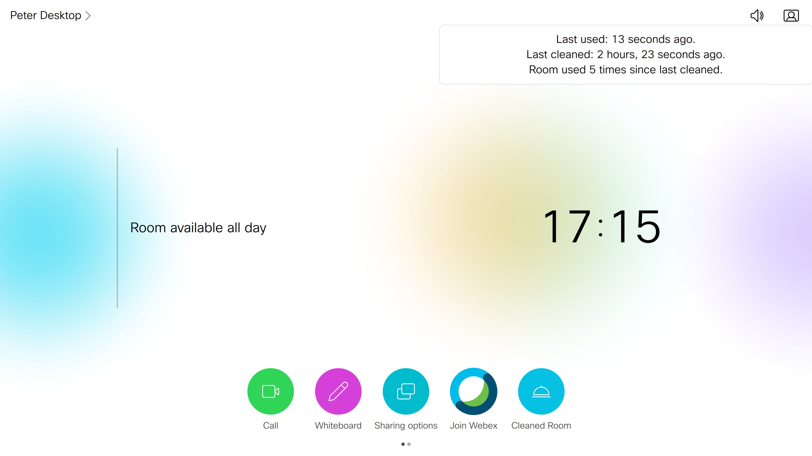
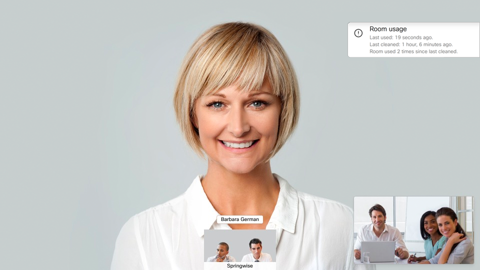

# Room Cleaning and Usage Macro
Customisation for easily recording when a room has been cleaned, and show this to users.

This macro demonstrates how to use the intelligence of a Cisco Webex Room device to record if a room is cleaned (via a UI Extensions button that the macro will automatically generate), how long it has been since the device detected someone and how many times people have been detected since it was last cleaned. It was also warn users if the room capacity has been exceeded. The macro will record cleaning times and the number of detections since last cleaned in a secondary macro which it will also create itself. The cleaning button is PIN protected, the PIN can be edited in the macro.

---
Snapshot of Room Usage Message:

---
Snapshot of Room Alert Summary:

---
Snapshot of Room Usage Panel:

## Requirements
1. A Cisco Webex Room, Board or Desk device
2. A touch controller connected to the Webex Room or Webex Board device to record cleaning events
3. If using a device with an external camera, that camera must be a Cisco Quad Camera
4. Admin user or integrator access to the Webex device
5. Firmware CE9.12.3 or newer or RoomOS for enhanced people detection

## Usage
1. Read the document "Working with Macros and In-room Controls" for an overview about In-Room Controls, Macros as well as step-by-step instructions on how to build and upload your code.

## Disclaimer
This example is only a sample and is **NOT guaranteed to be bug free and production quality**.

The sample macros are meant to:
- Illustrate how to use the macros.
- Serve as an example of the step-by-step process of building a macro using JavaScript and integration with the device xPI
- Provided as a guide for a developer to see how to initialize a macro and set up handlers for user and dialog updates.

The sample macros are made available to Cisco partners and customers as a convenience to help minimize the cost of Cisco Finesse customizations. Cisco does not permit the use of this library in customer deployments that do not include Cisco Video Endpoint Hardware.

## Support Notice
[Support](http://developer.cisco.com/site/devnet/support) for the macros is provided on a "best effort" basis via DevNet. Like any custom deployment, it is the responsibility of the partner and/or customer to ensure that the customization works correctly and this includes ensuring that the macro is properly integrated into 3rd party applications.

It is Cisco's intention to ensure macro compatibility across versions as much as possible and Cisco will make every effort to clearly document any differences in the xAPI across versions in the event that a backwards compatibility impacting change is made.

Cisco Systems, Inc. 
[http://www.cisco.com](http://www.cisco.com) 
[http://developer.cisco.com/site/roomdevices](http://developer.cisco.com/site/roomdevices)
